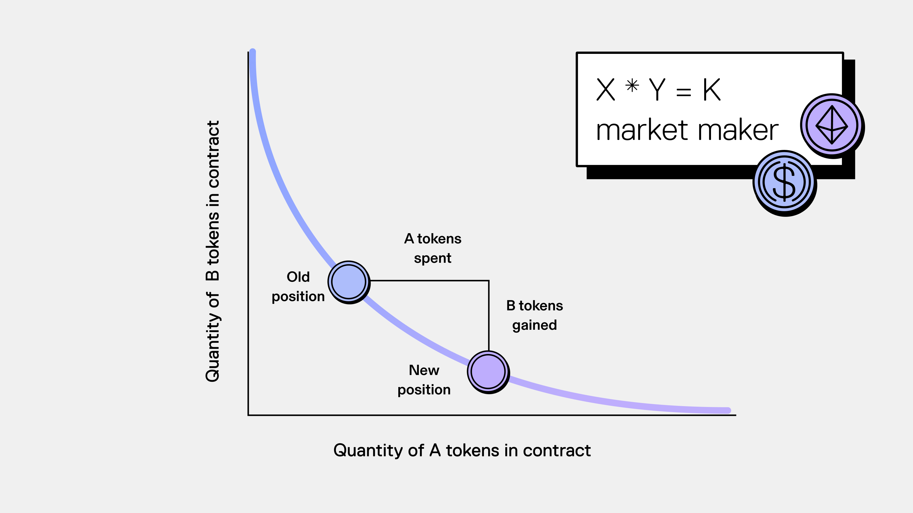
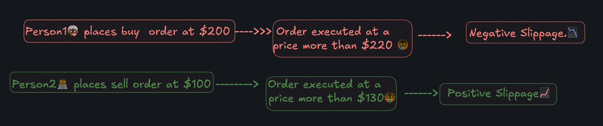
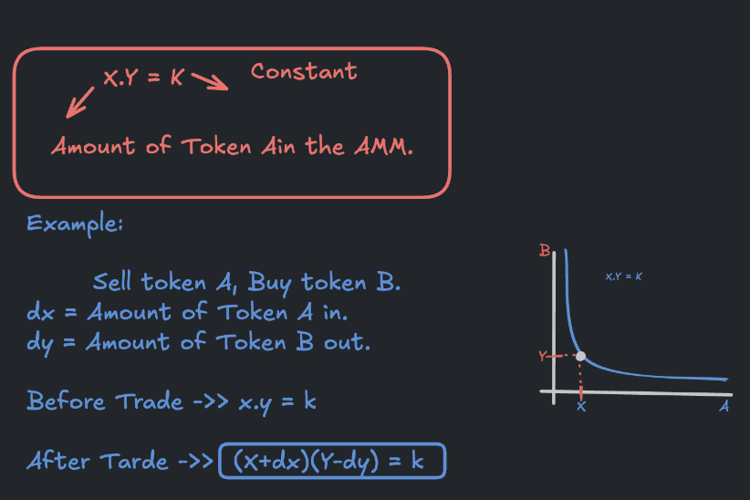
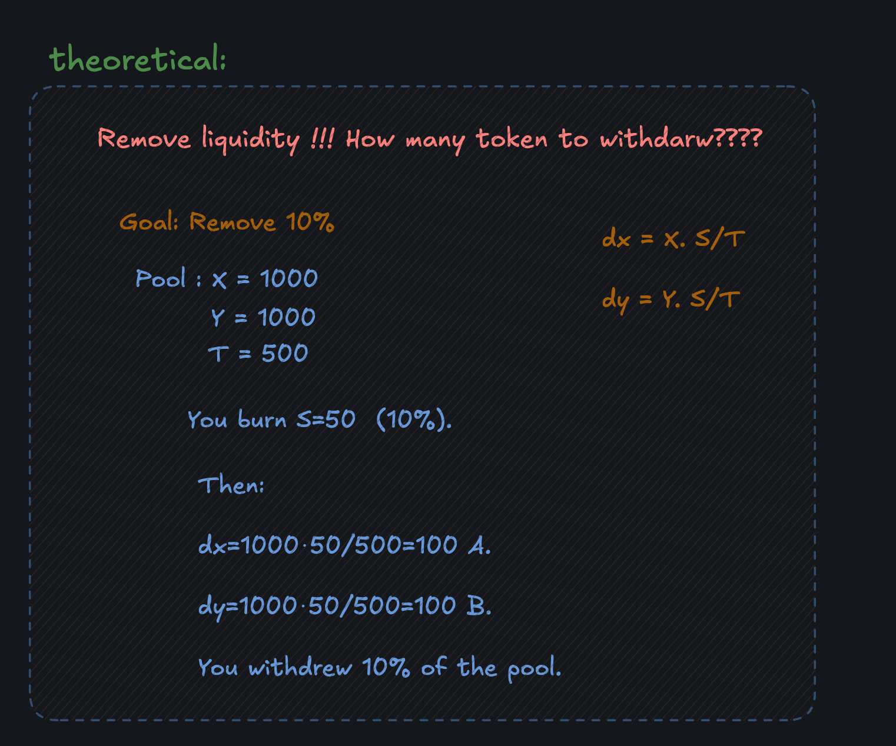

# Constant Product AMM

## Outline

### What is an AMM?

- **AMM (Automated Market Maker)** is a smart contract that:
  - Holds two tokens in a pool, with reserves `X` and `Y`.
  - Always offers a price using a formula instead of an order book.

- **Price of tokens** is determined by the equation:  
  **`x * y = k`**

  

  - `x` and `y` represent the quantities (not market values) of each token in the pool.
  - The total value of one token in an AMM liquidity pool always matches the value of the other, keeping the pool balanced at all times.
  - `k` is a fixed value — the product of `x` and `y` — that must remain constant after each trade.

---

## 🧠 Example: How Does It Work?

- **Starting Pool**: 10 ETH and 20,000 USDC.  
  The constant product formula is:  
  `10 × 20,000 = 200,000` (k stays constant).

- At this point, **1 ETH = 2,000 USDC**.

- **A user wants to buy 1 ETH**:
  - After the trade, 9 ETH remain in the pool.
  - To keep `k = 200,000`, solve for USDC:  
    `200,000 ÷ 9 ≈ 22,222.22 USDC`.
  - The new USDC balance is **22,222.22**.

- **User adds 2,222.22 USDC** (22,222.22 - 20,000), making their effective price for 1 ETH: **2,222.22 USDC**.

### Why Does the Price Increase?

- This is called **slippage**.
- A trade changes the token balances in the pool, which alters the price.
- Larger trades (relative to the pool size) cause more slippage.
- Bigger pools have more liquidity, so prices stay steadier even for bigger trades.

---

## ⭐️ What is Slippage?

- **Slippage**: The difference between the quoted price and the actual price at which your order is filled.
  - **Positive Slippage**: Better than expected.
  - **Negative Slippage**: Worse than expected.
  - **Zero Slippage**: Almost the same as expected.

---

## ⭐️ Swap: How Many Tokens to Return in a Trade?

- **Swapping from Token A to Token B**:
  - `dx`: Amount of Token A added to the pool.
  - `dy`: Amount of Token B removed from the pool.

### Formula Derivation:

1. **Before Swap**:  
   `X * Y = k`

2. **After Swap**:  
   `(X + dx)(Y - dy) = k`

3. Solve for `dy`:  
   `dy = Ydx / (X + dx)`

---

## ⭐️ Add Liquidity

- **Liquidity** increases proportionally to the increase in shares.

### Example:

- **Reserves**: 1000 A and 1000 B.  
- **Shares**: 1000 LP tokens.  
- **Adding Liquidity**: 20 A and 20 B.  
  - New reserves: 1020 A, 1020 B.
  - Liquidity increases by 2%, so shares also increase by 2%.
  - Your share of the pool: `20 / 1020 ≈ 1.96%`.

### Formula for Shares to Mint:

1. `L1 / L0 = (T + S) / T`
2. Rearrange to solve for `S`:  
   `S = T * (L1 - L0) / L0`

---

## ⭐️ Measuring Total Liquidity from X and Y

- **Total Liquidity**:  
  `f(X, Y) = √(X * Y)`

- Why not use `X * Y`?  
  Liquidity value would explode quadratically, much faster than token amounts.

---

## ⭐️ What is L0 and L1?

- **L0**: Initial Liquidity = `√(X * Y)`  
- **L1**: New Liquidity = `√((X + dx) * (Y + dy))`

### Formula Derivation:

1. `L1 - L0 / L0 = dx / X = dy / Y`

2. Substitute and simplify:  
   `L1 - L0 / L0 = (√(X * Y) + Xdy + dxY + dxdy - √(X * Y)) / √(X * Y)`

---

## ⭐️ Remove Liquidity: How Many Tokens to Withdraw?

- **Withdraw tokens proportional to shares**.

### Formula:

1. `dx = X * S / T`  
   `dy = Y * S / T`

2. Derivation:  
   - `a = Amount Out = √(dx * dy)`  
   - `L = Total Liquidity = √(X * Y)`  
   - `S = Shares to Burn`  
   - `T = Total Shares`

---

## References:

- [Uniswap Blog Post](https://blog.uniswap.org/what-is-an-automated-market-maker): A clear introduction to AMMs.
- [ProgrammerSmart's Video](https://www.youtube.com/watch?v=QNPyFs8Wybk): A detailed breakdown of the mathematical foundations of Constant Product AMM.