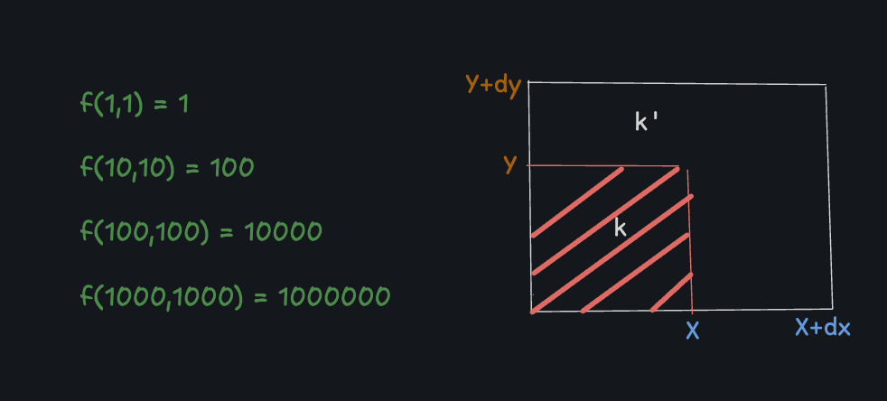

# constant product AMM :

## Outline
    
    What is an AMM?

      
       * AMM = Automated Market Maker. It is a smart 
        contract that:

       * Holds two tokens in a pool,reserves X and Y.

       * Always offers a price using a formula instead of 
         an order book.

      

     ** Price of a tokens are determined by the equation 
         x*y=k.

      x and y represent the quantities (not market values)
      of each token in the pool. The total value
      of one token in an AMM liquidity pool always matches 
      the value of the other, keeping the pool balanced at 
      all times.

       k is a fixed value — the product of those x and y 
    amounts — that must remain constant after each trade.

## 🧠 Let’s illustrate this concept with an example
    Starting pool: 10 ETH and 20,000 USDC. The constant product formula is 10 × 20,000 = 200,000 (k stays constant).

      At this point, 1 ETH = 2,000 USDC.

     A user wants to buy 1 ETH. After the trade, 9 ETH remain in the pool. To keep k = 200,000, we solve for USDC: 200,000 ÷ 9 ≈ 22,222.22 USDC.
     
     The new USDC balance is 22,222.22.

    The user adds 2,222.22 USDC (22,222.22 - 20,000), making their effective price for 1 ETH: 2,222.22 USDC.

    Why does the price increase? This is called slippage. A trade changes the token balances in the pool, which alters the price. Larger trades (relative to the pool size) cause more slippage. Bigger pools have more liquidity, so prices stay steadier even for bigger trades.

## ⭐️ what is Slippage??

     You see a price (quoted price), click buy/sell, but 
     your order gets filled at a slightly different price; 
     that gap is slippage.
​

    This can be better than you expect(positive slippage),
    worse (negative slippage) 
    or almost the same (zero slippage).

## ⭐️ Swap how many token to return in a trade?? 

   Swaping from Token A to Token B.

    dx = Amount of token A in. 

    dy = Amount of token B out.

Before Swap:              
X.Y = k    

After Swap
:
(X + dx)(Y - dy) = k.
    
    (X + dx)(Y - dy) = K
    
    dy??

    Y-dy = k/(X + dx)

    dy = Y- XY/(X + dx)

    dy = Xy - Yx + Ydx/(X + dx)

    dy = Ydx/(X + dx)

## ⭐️ Add Liquidity: 

-   How many shares to Mint??

   

## ⭐️ How many shares to Mint??

* Increase in Liquidity  is propotional to increase in Share.

        Lo = total liquid before.

        L1 = total liquid after.

        S = total shares to mint.

        T = total shares before.

            
finding S??

    L1/L0 = T+ S / T  ------>>>  L1/L0 = T+S/T  ---- (1)

    L1/L0 * T = T + S   ---- (2)

    L1/L0.T - T = S    -----> (3)

    TL1/L0 - T = TL1-TL0/L0 = S -----> (4)

    S = T(L1 - L0)/L0     

                
## ⭐️ How to measure total liquidity from X and Y??

    f(X,Y) = total liquidity.

    f(X,Y) = √(X*Y)

    XY = K

    (X+dx)(Y+dy) = K'

- Adding liquidity increases K (area of XY)

## ⭐️ What is L0 and L1??

  f(X,Y) =   total Liquidity 
  
        √(X*Y) --> L0 = √(X*Y)
                   L1 = √((X+dx)*(Y+dy))  -----(1)

            L1-L0/L0 T = S => L1-Lo/L0 = dx/X = dy/Y --(2)

            L1-L0/L0 = (√(X+dx)*(Y+dy) - √(X*Y))/√(X*Y)--(3)

    L1-L0/L0  = (√XY + Xdy + dxY + dxdy - √(XY))/√XY  ---(4) 

dx/dy = X/Y So dy = Ydx/X

    L1-L0/L0 = (√XY + X(Ydx/X) + dxY + dx(Ydx/X) - √(XY))/√XY  ---(5)

    L1-L0/L0 = (√XY + Ydx + Ydx + dx^2(Y/X) - √(XY))/√XY  ---(6)  {pull out Y}

    √X +2dx + dx^2/X - √XY/√XY --(7) {multiply by }
  

     √x/√x √X + 2dx + dx^2/X - √XY/√XY --(8)
 
    √X^2+ 2Xdx + dx^2 - √X^2Y/√X^2Y --(9)

     (X+dx)√Y- X√Y/√XY --(10)

    X√Y+ dx√Y - X√Y/√XY --(11)

    dx/x√Y/√XY --(12)

## ⭐️ Remove Liquidity: How many tokens to Withdraw??

     Withdraw tokens propotional to shares. 

     a = Amount Out = f(dx/dy) = √dxdy

     L = Total Liquidity = f(X,Y) = √XY

     S = Amount of Shares to burn

     T = Total Shares

   

                 a/L = S/T  -----> a = L*S/T

                 √dxdy/√XY = S/T 

                 find dx ?? 

dx/dy = X/Y So dy = Ydx/X

                    √dxdy =  √XY * S/T
                    √dx(Ydx/X) =  √XY * S/T  {pull out dx}

                    dx √Y/X =  √XY * S/T
                    dx =  √XY * S/T * √Y/X

                    dx =  X * S/T

Likewise:               
                       
                         dy = Y * S/T                    

    
## References:

*  This blog post from Uniswap https://blog.uniswap.org/what-is-an-automated-market-maker provides a clear introduction to automated market makers (AMMs)

* @ProgrammerSmart's  detailed video (https://www.youtube.com/watch?v=QNPyFs8Wybk) breaks down the mathematical foundations of Constant Product AMM.

